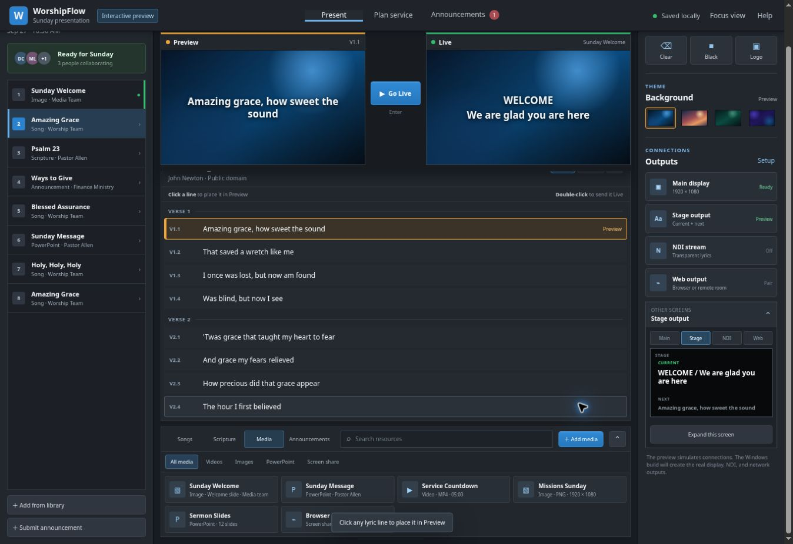

# WorshipFlow Interactive Preview

**[Open the live interactive preview](https://daniel12cameron-max.github.io/worshipflow-preview/)**

WorshipFlow is an offline-first church presentation app with a simple, schedule-first Sunday workflow. This public repository contains the browser-safe interactive demonstration.

## Try the Sunday workflow

- Choose an item from the Sunday Schedule
- Keep Preview and Live pinned while scrolling through long lyric and media lists
- Single-click a lyric line to place it in Preview
- Double-click a line, press Enter, or use Go Live to send it to the congregation
- Switch between one-line and two-line lyric grouping
- Collapse the schedule, lyric area, resource library, or output controls—or use Focus view
- Paste a new song and add it to the service
- Organize media into Videos, Images, PowerPoint, and Screen Share sources
- Open Plan service to reorder the schedule and view collaborators
- Submit an announcement, approve it, and add it to Sunday automatically
- Expand and inspect Main, Stage, NDI, and paired Web Output screens
- Change backgrounds and test Clear, Black, and Logo controls

## Demo limits

The browser preview demonstrates the workflow and resets when the page refreshes. It does not read or change files on your computer. The installable Windows app will provide real projector and stage windows, native NDI output, offline storage, Bible integrations, and a safe EasyWorship 7 migration assistant.

The Windows application source remains in a separate private repository. This public repository contains only the preview.
