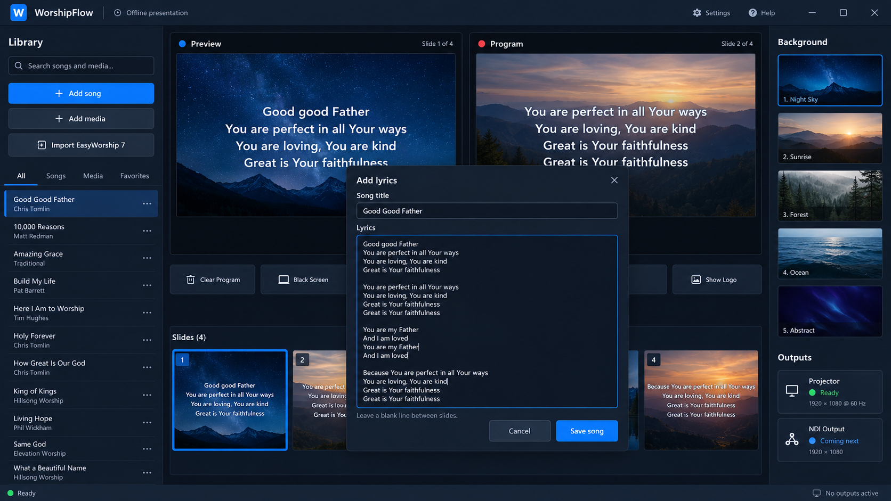

# WorshipFlow Interactive Preview

**[Open the live interactive preview](https://daniel12cameron-max.github.io/worshipflow-preview/)**

This public repository contains the browser-safe demonstration of WorshipFlow, an offline-first church presentation app.

## Try the workflow

- Choose songs or a Bible passage from the Library
- Single-click a slide to load Preview
- Double-click a slide to send it to Program
- Change backgrounds and test Clear, Black Screen, and Show Logo
- Paste lyrics and split them into slides using blank lines
- Simulate the NDI control state

## Demo limits

The browser preview demonstrates the operator workflow and resets when the page refreshes. It does not read or change files on your computer. The installable Windows app will provide the real projector/second-display output, native NDI output, offline library, Bible integrations, and safe EasyWorship 7 migration.

The Windows application source remains in a separate private repository; this public repository contains only the preview.
